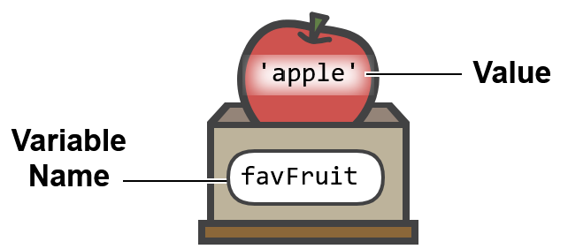
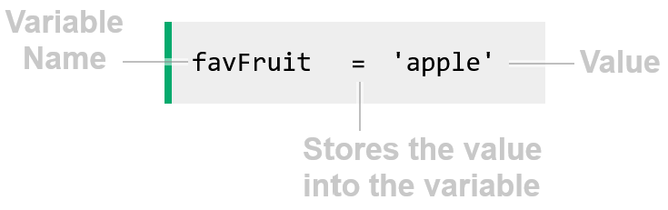

    Variables
        Variables are one of the most basic and essential concepts in programming, used to store values.

    What is a Variable?
        A variable has a name, and you can store something in it.
        The image below shows how we can think of a variable named favFruit, with the value 'apple' stored inside it.

        
        Below is how we can create the favFruit variable, using Python code:

        The code above creates a variable named favFruit,
        and the equal sign = is used to store the value 'apple' inside the variable.
        The reason for giving a variable a name is to be able to use it later in the code, and also to know what value it holds.

    Creating a Variable
        Below is the code for creating the favAnimal variable in different programming languages.
            Python:
                favAnimal = 'turtles'
            
            JavaScript:
                const favAnimal = 'turtles';
            
            Java:
                String favAnimal = "turtles";
            
            C++:
                string fav_animal = "turtles";
        
        Variables can hold different types of data, like whole numbers, decimal numbers, or text.
        Note: When creating a variable in programming languages like C/C++ and Java,
        we must tell the computer what type of data the variable holds.
        To do that we need to write for example int in front of the variable name,
        if the variable holds a whole number (integer).

    Doing Things with Variables
        Like we have just seen in the previous example, a value can be stored in a variable.
        And if you run the example code above, you see how a variable is printed.
        We can do other things with variables as well, like math operations, or put variables with text strings together.

    Add a Variable to a String
        To use a variable in a string, you can add it to the string, like this:
            Python:
                a = 'Jane'
                print('Hello, my name is ' + a) // Output: My name is Jane

            JavaScript:
                const a = 'Jane';
                console.log('Hello, my name is ' + a); // Output: My name is Jane

            Java:
                String a = "Jane";
                System.out.println("Hello, my name is " + a); // Output: My name is Jane

            C++:
                string a = "Jane";
                cout << "Hello, my name is " + a; // Output: My name is Jane

    Add Two String Variables Together
        You can add two string variables together to form a sentence, using the + operator, like this:
            Python:
                a = 'Jane'
                b = 'My name is '
                print(b + a) // Output: My name is Jane

            JavaScript:
                const a = 'Jane';
                const b = 'My name is ';
                console.log(b + a); // Output: My name is Jane

            Java:
                String a = "Jane";
                String b = "My name is ";
                System.out.println(b + a); // Output: My name is Jane

            C++:
                string a = "Jane";
                string b = "My name is ";
                cout << b + a; // Output: My name is Jane

    Add Two Number Variables
        If the variables are numeric values, you can perform mathematic operations on them, like adding two numbers:
            Python:
                a = 2
                b = 3
                print(a + b) // Output: 5

            JavaScript:
                const a = 2;
                const b = 3;
                console.log(a + b); // Output: 5

            Java:
                int a = 2;
                int b = 3;
                System.out.println(a + b); // Output: 5

            C++:
                int a = 2;
                int b = 3;
                cout << a + b; // Output: 5

        Another way to add two variables, is to make an extra variable c to hold the sum,
        and present the answer with a text string:
            Python:
                a = 2
                b = 3
                c = a + b
                print('The sum a + b is ' + str(c)) // Output: The sum a + b is 5
            
            JavaScript:
                const a = 2;
                const b = 3;
                const c = a + b;
                console.log('The sum a + b is ' + c); // Output: The sum a + b is 5

            Java:
                int a = 2;
                int b = 3;
                int c = a + b;
                System.out.println("The sum a + b is " + c); // Output: The sum a + b is 5

            C++:
                int a = 2;
                int b = 3;
                int c = a + b;
                cout << "The sum a + b is " + to_string(c) + "\\n"; // Output: The sum a + b is 5
        
        Note: The + operator is used to both add numbers, and to put strings together.
        In Python and C++ we need to convert a number to a string before we can put it together with a string.

    Incrementing a Variable
        We can create a variable, and update the value by adding 1 to it, like this:
            Python:
                a = 2
                a = a + 1
                print(a) // Output: 3

            JavaScript:
                let a = 2;
                a = a + 1;
                console.log(a); // Output: 3

            Java:
                int a = 2;
                a = a + 1;
                System.out.println(a); // Output: 3

            C++:
                int a = 2;
                a = a + 1;
                cout << a; // Output: 3
        
        Incrementing a variable is a common operation in programming, and it's often used in loops.
        It is so common in fact, that many programming languages have a shorthand for it,
        like ++ in C/C++ and Java, or += in Python.

    Decrementing a Variable
        If we want to decrement a variable, we can do that in a similar way as incrementing.
        And the number we want to decrement by can be any number, not just 1.
        The code below shows how to decrement a variable by 3 in different programming languages, using shorthand.
            Python:
                a = 5
                a -= 3
                print(a) // Output: 2

            JavaScript:
                let a = 5;
                a -= 3;
                console.log(a); // Output: 2

            Java:
                int a = 5;
                a -= 3;
                System.out.println(a); // Output: 2

            C++:
                int a = 5;
                a -= 3;
                cout << a; // Output: 2

    Using a Variable in an if Statement
        We can use a variable in an if statement, as part of the condition, like this:
            Python:
                temperature = 25
                print('Temperature: ' + str(temperature) + '°C')
                if temperature > 20:
                    print('It is warm') // Output: It is warm
                else:
                    print('It is not warm')

            JavaScript:
                const temperature = 25;
                console.log('Temperature: ' + temperature + '°C');
                if (temperature > 20) {
                    console.log('It is warm'); // Output: It is warm
                } else {
                    console.log('It is not warm');
                }

            Java:
                int temperature = 25;
                System.out.println("Temperature: " + temperature + "°C");
                if (temperature > 20) {
                    System.out.println("It is warm"); // Output: It is warm
                } else {
                    System.out.println("It is not warm");
                }

            C++:
                int temperature = 25;
                cout << "Temperature: " + to_string(temperature) + "°C\\n";
                if (temperature > 20) {
                    cout << "It is warm\\n"; // Output: It is warm
                } else {
                    cout << "It is not warm\\n";
                }

    The Variable Name
        There are certain rules that applies when naming a variable.
        Some rules are programming-languange-specific, others applies to all programming languages:
            A variable name cannot contain spaces.
            A variable name cannot start with a number.
            A variable name cannot be a reserved word like if, else, for, function etc.

        For readability, it is common to use camelCase or snake_case when naming variables,
        so instead of myfavanimal, we can use myFavAnimal or my_fav_animal.

EOF
