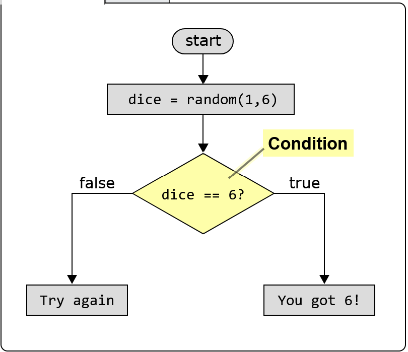
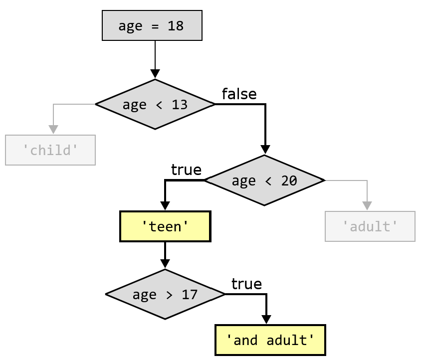

    If Statements
        If statements allow your program to make decisions, so it can do different things depending on the situation.

    What is an If Statement?
        An if statement runs a block of code if the condition is true.
        We do similar things in real life, like using an umbrella if it's raining, or wearing a coat if it's cold.

        See how an if statement works in the simple game below. The goal is to get 6 when you roll the dice.
            dice = random.randint(1,6)
            print('You rolled a ' + str(dice))
            if dice == 6: // Condition
                print('You got 6!') // Code runs if condition is true
            else:
                print('Try again') // Code runs if condition is false

        To make the game do something different depending on the dice result,
        we use if with a condition that checks if the dice result is 6.
        In case the condition is true, we print "You got 6!". And in case the condition is not true, we print "Try again".
        We must use else in the code above, to handle the case when the dice is not 6, so that we can write "Try again".

        Here is the flow chart for the game:

        Examples in Python, JavaScript, Java and C++:
            Python:
                dice = random.randint(1,6)
                print('You rolled a ' + str(dice))
                if dice == 6:
                    print('You got 6!🥳')
                else:
                    print('Try again')

            JavaScript:
                const dice = Math.floor(Math.random() * 6) + 1;
                console.log('You rolled a ' + dice);
                if (dice == 6) {
                    console.log('You got 6!🥳');
                } else {
                    console.log('Try again');
                }

            Java:
                int dice = random.nextInt(6) + 1;
                System.out.println("You rolled a " + dice);
                if (dice == 6) {
                    System.out.println("You got 6!🥳");
                } else {
                    System.out.println("Try again");
                }

            C++:
                int dice = rand() % 6 + 1;
                cout << "You rolled a " + to_string(dice) + "\\n";
                if (dice == 6) {
                    cout << "You got 6!🥳\\n";
                } else {
                    cout << "Try again\\n";
                }

    When Should I Use an If Statement?
        When you want your program to do something different depending on the situation, you should use an if statement.
        For example, in case you want your program to print "Welcome!" when the user enters the correct password,
        and "Access denied" when the user enters the wrong password, you should use an if statement.

    If, Else, and Else If
        An if-statement allways starts with an if.
        An if-statement can contain zero or many else if, and zero or one else.
        When else is present, it has to come last, after all the else if.
        The else statement ensures that one (and only one) of the code blocks will execute.

        Sometimes it is enough to just use a single if, but usually,
        we also want to handle the case when the condition is not true, so we use an else statement for that.
        The code block that belongs to the else will only be executed in case the condition in the if is false.
        We can also use else if to check more than one condition, so that we get more than two outcomes.
            Python:
                age = 15
                print('Age: ' + str(age))
                if age < 13:
                    print('You are a child')
                elif age < 20:
                    print('You are a teenager') // Output: You are a teenager
                else:
                    print('You are an adult')

            JavaScript:
                const age = 15;
                console.log('Age: ' + age);
                if (age < 13) {
                    console.log('You are a child');
                } else if (age < 20) {
                    console.log('You are a teenager'); // Output: You are a teenager
                } else {
                    console.log('You are an adult');
                }

            Java:
                int age = 15;
                System.out.println("Age: " + age);
                if (age < 13) {
                    System.out.println("You are a child");
                } else if (age < 20) {
                    System.out.println("You are a teenager"); // Output: You are a teenager
                } else {
                    System.out.println("You are an adult");
                }

            C++:
                int age = 15;
                cout << "Age: " + to_string(age) + "\\n";
                if (age < 13) {
                    cout << "You are a child";
                } else if (age < 20) {
                    cout << "You are a teenager"; // Output: You are a teenager
                } else {
                    cout << "You are an adult";
                }

        You can only have one if statement, and only one else statement, but you can have as many else if statements as you want.
        Also, the if is always first, the else is always last, and the else if statements are in between.

    Nested If Statements
        A nested if statement is an if statement inside another if statement.
        Nested if statements are useful in cases where you want to check a condition, only if another condition is true.
            Python:
                age = 19
                print('Age: ' + str(age))
                if age < 13:
                    print('You are a child')
                elif age < 20:
                    print('You are a teenager') // Output: You are a teenager
                    if age > 17:
                        print('and an adult!') // Output: and an adult!
                else:
                    print('You are an adult')

            JavaScript:
                const age = 19;
                console.log('Age: ' + age);
                if (age < 13) {
                    console.log('You are a child');
                } else if (age < 20) {
                    console.log('You are a teenager'); // Output: You are a teenager
                    if (age > 17) {
                        console.log('and an adult!'); // Output: and an adult!
                    } 
                } else {
                    console.log('You are an adult');
                }

            Java:
                int age = 19;
                System.out.println("Age: " + age);
                if (age < 13) {
                    System.out.println("You are a child");
                } else if (age < 20) {
                    System.out.println("You are a teenager"); // Output: You are a teenager
                    if (age > 17) {
                        System.out.println("and an adult!"); // Output: and an adult!
                    } 
                } else {
                    System.out.println("You are an adult");
                }

            C++:
                int age = 19;
                cout << "Age: " + to_string(age) + "\n";
                if (age < 13) {
                    cout << "You are a child";
                } else if (age < 20) {
                    cout << "You are a teenager"; // Output: You are a teenager
                    if (age > 17) {
                        cout << "\nand an adult!"; // Output: and an adult!
                    } 
                } else {
                    cout << "You are an adult";
                }

        In the code above, the nested if statement allows us to filter out
        the special case of ages 18 and 19, when you are both a teenager and an adult.
        In the flowchart below, we can see that the code block for age > 17 is only executed if the age is 18 or 19.

EOF
