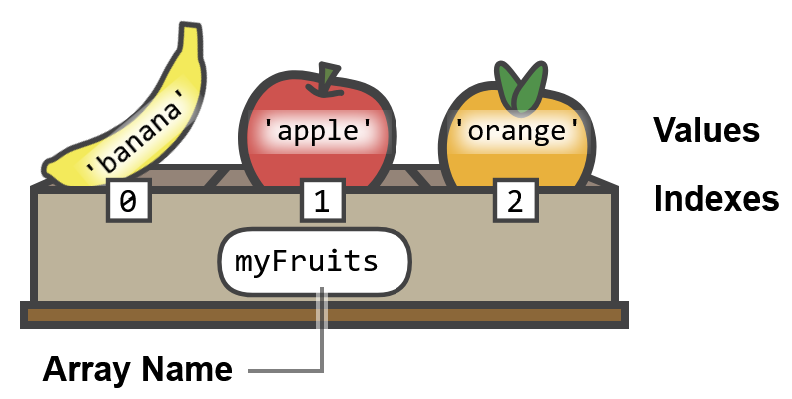
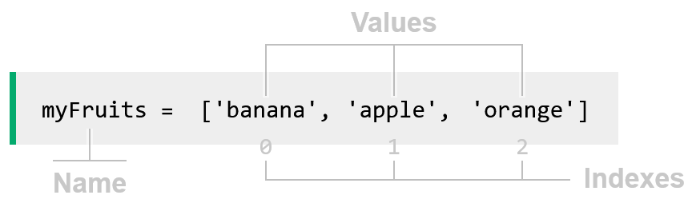

    Arrays
        Arrays are made for storing many values together.

    What is an Array?
        An array is a collection of values.
        The image below shows how we can think of an array named myFruits,
        with the values 'banana', 'apple', and 'orange' stored inside it.

        Each value in an array has a position, called index, which starts at 0.
        Below is how the myFruits array is created, using Python code:

    
        The first value 'banana' is positioned at index 0 in the array.

    What Can I Do With an Array?
        Arrays make it easier to work with groups of values compared to using a separate variable for each value.
        So instead of creating 3 variables:
            fruit1 = 'banana'
            fruit2 = 'apple'
            fruit3 = 'orange'

        We can just create an array:
            myFruits = ['banana', 'apple', 'orange']
        
        With an array, you can:
            Store a collection of numbers, words, or objects.
            Access any value using its index (position).
            Read, update, insert, or remove any of the array values.

    Creating an Array
        When creating an array we must specify the name of the array and the values inside it.
        Here is how the myFruits array can be created using different programming languages:
            Python:
                myFruits = ['banana', 'apple', 'orange']

            JavaScript:
                const myFruits = ['banana', 'apple', 'orange'];

            Java:
                String[] myFruits = {"banana", "apple", "orange"};

            C++:
                string myFruits[] = {"banana", "apple", "orange"};

        In the Python code above:
            myFruits is the name of the array.
            The equal sign = stores the values on the right side into the array.
            The square brackets [ ] mean we are creating an array.
            'banana', 'apple', 'orange' are the values inside the array, separated by comma.
        
        Note: When creating an array in programming languages like C/C++ and Java,
        the data type of the values inside the array must be stated.

    Array Operations
        Arrays can be read and manipulated in many different ways, here are some common things you can do with an array:
            Operation   Description
            read 	    Reads a value from an index in the array.
            update 	    Updates the existing value at an array index position.
            insert 	    Inserts a new value in the array, in addition to the existing values.
            remove 	    Removes a value from the array at a given index position.
            length 	    Gives us the number of values in the array. The number of values is the length of an array.
            loop 	    Visits each value in the array, using a loop.

    Reading an Array Value
        To read an array value, we use the array name with the index
        of the value we want to read in brackets, like this myFruits[0].
        We must also use a command to write myFruits[0] to the console/terminal,
        so that we can actually see the result, and that is done a little different depending on the programming language.
            Python:
                myFruits = ['banana', 'apple', 'orange']
                print(myFruits[0])

    Updating an Array Value
        To update a value in an array, we use the array name with the index position of the value we want to update,
        like this myFruits[0], and then we use the equal sign = to store a new value there.
            Python:
                myFruits = ['banana', 'apple', 'orange']
                myFruits[0] = 'kiwi'

    Inserting an Array Value
        To insert a value into an array, in addition to the existing values, we need:
            the array name
            a command to do the insert operation
            the value to be inserted
        
        The command to insert a value into an array varies a bit between the programming languages.
            Python:
                myFruits = ['banana', 'apple', 'orange']
                myFruits.append('kiwi')

            JavaScript:
                const myFruits = ['banana', 'apple', 'orange'];
                myFruits.push('kiwi');

            Java:
                ArrayList<String> myFruits = new ArrayList<String>();
                myFruits.add("banana");
                myFruits.add("apple");
                myFruits.add("orange");
                myFruits.add("kiwi");

            C++:
                vector<string> myFruits = {"banana", "apple", "orange"};
                myFruits.push_back("kiwi");
        
        When we do insert this way, the new value is inserted at the end of the array.

        A Dynamic Array is an array that is able to change size, like it must for insert and remove operations.
        In such cases where the array changes size, we use ArrayList in Java and vector in C++.

        A value can also be added to a specific position in an array, using the index, like this:
            Python:
                myFruits = ['banana', 'apple', 'orange']
                myFruits.insert(1,'kiwi')

            JavaScript:
                const myFruits = ['banana', 'apple', 'orange'];
                myFruits.splice(1,0,'kiwi');

            Java:
                ArrayList<String> myFruits = new ArrayList<String>();
                myFruits.add("banana");
                myFruits.add("apple");
                myFruits.add("orange");
                myFruits.add(1,"kiwi");

            C++:
                vector<string> myFruits = {"banana", "apple", "orange"};
                myFruits.insert(myFruits.begin() + 1, "kiwi");

    Removing an Array Value
        An array value is removed by specifying the index where the value should be removed from.
        This is how an array value placed at index 1 can be removed in different programming languages:
            Python:
                myFruits = ['banana', 'apple', 'orange']
                myFruits.pop(1)

            JavaScript:
                const myFruits = ['banana', 'apple', 'orange'];
                myFruits.splice(1,1);

            Java:
                ArrayList<String> myFruits = new ArrayList<String>();
                myFruits.add("banana");
                myFruits.add("apple");
                myFruits.add("orange");
                myFruits.remove(1);

            C++:
                vector<string> myFruits = {"banana", "apple", "orange"};
                myFruits.erase(myFruits.begin() + 1);
        
        A value can also be removed from the end of an array, without using the index (except for Java), like this:
            Python:
                myFruits = ['banana', 'apple', 'orange']
                myFruits.pop()

            JavaScript:
                const myFruits = ['banana', 'apple', 'orange'];
                myFruits.pop();

            Java:
                ArrayList<String> myFruits = new ArrayList<String>();
                myFruits.add("banana");
                myFruits.add("apple");
                myFruits.add("orange");
                myFruits.remove(myFruits.size()-1);

            C++:
                vector<string> myFruits = {"banana", "apple", "orange"};
                myFruits.pop_back();

    Finding the length of an Array
        You can always check the length of an array:
        This is how the length of an array is found in different programming languages:
            Python:
                myFruits = ['banana', 'apple', 'orange']
                print(len(myFruits))

            JavaScript:
                const myFruits = ['banana','apple','orange'];
                console.log(myFruits.length);

            Java:
                ArrayList<String> myFruits = new ArrayList<String>();
                myFruits.add("banana");
                myFruits.add("apple");
                myFruits.add("orange");
                System.out.println(myFruits.size());

            C++:
                vector<string> myFruits = {"banana", "apple", "orange"};
                cout << myFruits.size();

    Looping Through an Array
        Looping through an array means to look at every value in the array.
        There is more than one way to loop through an array,
        but using a for loop is perhaps the most straight forward way
        that is also supported in all programming languages, like this:
            Python:
                myFruits = ['banana', 'apple', 'orange']
                for fruit in myFruits:
                    print(fruit)

            JavaScript:
                const myFruits = ['banana', 'apple', 'orange'];
                for (let fruit of myFruits) {
                    console.log(fruit);
                }

            Java:
                String[] myFruits = {"banana", "apple", "orange"};
                for (String fruit : myFruits) {
                    System.out.println(fruit);
                }

            C++:
                string myFruits[] = {"banana", "apple", "orange"};
                for (auto fruit : myFruits) {
                    cout << fruit + "\n";
                }
        
        Another way to loop through an array is to use a for loop with a counting variable for the indexes, like this:
            Python:
                myFruits = ['banana', 'apple', 'orange']
                for i in range(len(myFruits)):
                    print(myFruits[i])

            JavaScript:
                const myFruits = ['banana', 'apple', 'orange'];
                for (let i = 0; i < myFruits.length; i++) {
                    console.log(myFruits[i]);
                }

            Java:
                String[] myFruits = {"banana", "apple", "orange"};
                for (int i = 0; i < myFruits.length; i++) {
                    System.out.println(myFruits[i]);
                }

            C++:
                string myFruits[] = {"banana", "apple", "orange"};
                int size = sizeof(myFruits) / sizeof(myFruits[0]);
                for (int i = 0; i < size; i++) {
                    cout << myFruits[i] + "\n";
                }
        
        Other things we can do with looping through arrays is to find out if "Bob" appears in an array of names,
        or we can loop through an array of groceries for example, to find the total sum we need to pay for them.
        Below is an example of looping through an array of names, looking for "Bob".
            Python:
                listOfNames = ['Jones', 'Jill', 'Lisa', 'Stan', 'Bob', 'Alice']
                for i in range(len(listOfNames)):
                    print(listOfNames[i])
                    if listOfNames[i] == 'Bob':
                        print('Found Bob!')
                        break

            JavaScript:
                let listOfNames = ['Jones', 'Jill', 'Lisa', 'Stan', 'Bob', 'Alice'];
                for (let i = 0; i < listOfNames.length; i++) {
                    console.log(listOfNames[i]);
                    if (listOfNames[i] === 'Bob') {
                        console.log('Found Bob!');
                        break;
                    }
                }

            Java:
                String[] listOfNames = {"Jones", "Jill", "Lisa", "Stan", "Bob", "Alice"};
                for (int i = 0; i < listOfNames.length; i++) {
                System.out.println(listOfNames[i]);
                    if (listOfNames[i] == "Bob") {
                        System.out.println("Found Bob!");
                        break;
                    }
                }

            C++:
                string listOfNames[] = {"Jones", "Jill", "Lisa", "Stan", "Bob", "Alice"};
                int size = sizeof(listOfNames) / sizeof(listOfNames[0]);
                for (int i = 0; i < size; i++) {
                    cout << listOfNames[i] + "\n";
                    if (listOfNames[i] == "Bob") {
                        cout << "Found Bob!\n";
                        break;
                    }
                }
            
            In the code above, the break statement stops the loop once "Bob" is found. That is why "Alice" is not printed.

    Strict Definition of an Array
        Arrays found in modern languages like Python or JavaScript are flexible, meaning arrays can grow, shrink,
        and hold different types of values. Other programming languages,
        like C and Java, require arrays to be defined more strictly.
        A more strict definition of an array means that in addition to being a collection of values, an array is also:
            fixed length
            same data type for all values
            stored contiguously in memory
        
        Fixed length means that the array length (the number of values inside the array), cannot be changed.
        When using the C programming language for example, if you have created an array of 4 values,
        the array length (4) is fixed and cannot be changed. So if you want to insert a 5th value at the end of your array,
        you must create a new array 5 values long, put in the original 4 values,
        and put the 5th value in the last place in new array where there is now place for it.

        Same datatype means that all values in the array must be of the same type,
        so they must all be whole numbers for example, or decimal numbers, or characters, or strings, or some other data type.
        
        Having the array stored contiguously in memory means
        that the values are stored right after each other in one block of memory,
        like a group of friends living right next to each other on the same street.

        Using arrays in their strict form gives the user full control over how the program actually executes,
        but it also makes it hard to do certain things, and it is more prone to errors.
        When in need for more flexible/dynamic array functionality in languages such as C or Java,
        developers often use libraries to help them get the expanded dynamic array functionality they are looking for.

EOF
