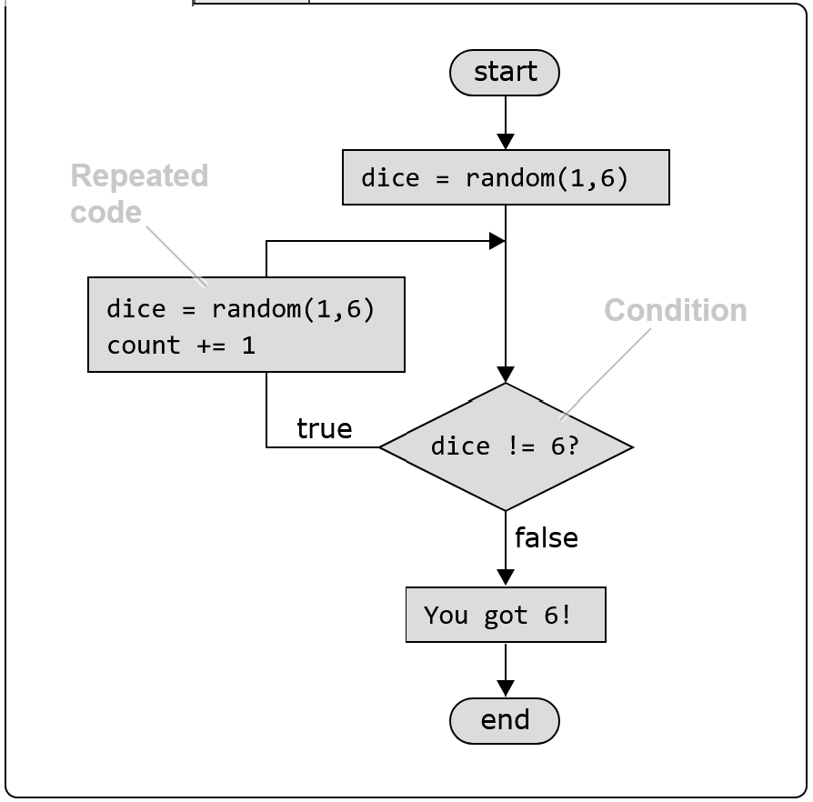
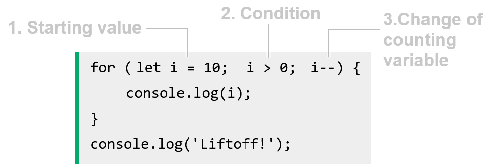

    Loops
        Loops are used when we need to run the same code lines many times.

    What is a Loop?
        A loop runs the same code over and over again, as long as the condition is true.
        The simulation below uses a loop to roll dice until the result is 6, counting how many times the dice was rolled.
            dice = random.randint(1,6)
            count = 1
            while dice != 6:
                dice = random.randint(1,6)
                count += 1
            print('You got 6!')
            print('You rolled', count, 'times')

        The loop continues to roll the dice until the result is 6,
        so the condition that ensures we roll the dice again is "dice is not 6".
        Below is a flow chart explaining how the loop runs:

        Note: != is a comparison operator, and it is the same as saying "not equal to".

        The code example above uses a while loop.
        Other loop types are for, for-each, and do-while.
        The loop types are all similar and described in more detail below.

    While Loop
        A while loop is best to use when you don't know how many times the code should run.
        The while loop is the most intuitive loop type because it resembles many things we do in our every day life:
            Keep walking (taking new steps) until you reach your destination.
            As long as the pot is dirty, continue washing it.
            Keep filling the tank of the car until it is full.

        As we saw in the example above, we cannot know how many times the code should run,
        because we don't know when the user will roll a 6, and that is why we use a while loop.
        Below is the complete code for the dice rolling, written in different programming languages.
            Python:
                dice = random.randint(1,6)
                print(dice)
                count = 1
                while dice != 6:
                    dice = random.randint(1,6)
                    print(dice)
                    count += 1
                print('You got 6!')
                print('You rolled',count,'times')

            JavaScript:
                let dice = Math.ceil(Math.random()*6);
                console.log(dice);
                let count = 1;
                while (dice != 6) {
                    dice = Math.ceil(Math.random()*6);
                    console.log(dice);
                    count += 1;
                }
                console.log('You got 6!');
                console.log('You rolled',count,'times');

            Java:
                int dice = random.nextInt(6) + 1;
                System.out.println(dice);
                int count = 1;
                while (dice != 6) {
                    dice = random.nextInt(6) + 1;
                    System.out.println(dice);
                    count++;
                }
                System.out.println("You got 6!");
                System.out.println("You rolled " + count + " times");

            C++:
                int dice = rand() % 6 + 1;
                cout << to_string(dice) + "\\n";
                int count = 1;
                while (dice != 6) {
                    dice = rand() % 6 + 1;
                    cout << to_string(dice) + "\\n";
                    count++;
                }
                cout << "You got 6!\\n";
                cout << "You rolled " + to_string(count) + " times\\n";
        
        If we know how many times the code should run, it usually makes sense to use a for loop instead of a while loop.

    For Loop
        A for loop is best to use when you know how many times the code should run,
        and the most basic thing we can do with a for loop is counting.
        To count, a for loop uses a counting variable to keep track of how many times the code has run.
        The counting variable in a for loop is set up like this:
            Starting value.
            Condition using the counting variable, the for loop runs as long as the condition is true.
            Description of how the counting variable should change each time the loop runs.

        The code example above simulates the launch of a space rocket.
        It counts down from 10 to 1, and then writes "Liftoff!", using a for loop with a counting variable i.
            Python:
                for i in range(10, 0, -1):
                    print(i)
                print('Liftoff!')

            JavaScript:
                for (let i = 10; i > 0; i--) {
                    console.log(i);
                }
                console.log('Liftoff!');

            Java:
                for (int i = 10; i > 0; i--) {
                    System.out.println(i);
                }
                System.out.println("Liftoff!");

            C++:
                for (int i = 10; i > 0; i--) {
                    cout << to_string(i) + "\n";
                }
                cout << "Liftoff!\n";
        
        Such for loops using a counting variable are written slightly different in Python,
        using the Python range() function, but the idea is the same.
        Note: The counting variable is often named i, j, or k. This keeps it short and makes it easier to read.
        These letters are also used in Mathematics, for similar things.

    For-Each Loop
        Going through a list of items, like an array for example,
        using a for loop without a counting variable, can be called "iterating", or "using a for-each loop".
        This is how we use a for-each loop to iterate over the values in an array:
            Python:
                myFruits = ['banana','apple','orange']
                for fruit in myFruits:
                    print(fruit)

            JavaScript:
                const myFruits = ['banana','apple','orange'];
                for (let fruit of myFruits) {
                    console.log(fruit);
                }

            Java:
                String[] myFruits = {"banana", "apple", "orange"};
                for (String fruit : myFruits) {
                    System.out.println(fruit);
                }

            C++:
                string myFruits[] = {"banana", "apple", "orange"};
                for (auto fruit : myFruits) {
                    cout << fruit + "\n";
                }

        Another way to iterate through an array is to use a for loop with a counting variable for the indexes, like this:
            Python:
                myFruits = ['banana', 'apple', 'orange']
                for i in range(len(myFruits)):
                    print(myFruits[i])

            JavaScript:
                const myFruits = ['banana', 'apple', 'orange'];
                for (let i = 0; i < myFruits.length; i++) {
                    console.log(myFruits[i]);
                }

            Java:
                String[] myFruits = {"banana", "apple", "orange"};
                for (int i = 0; i < myFruits.length; i++) {
                    System.out.println(myFruits[i]);
                }

            C++:
                string myFruits[] = {"banana", "apple", "orange"};
                int size = sizeof(myFruits)/sizeof(myFruits[0]);
                for (int i = 0; i < size; i++) {
                    cout << myFruits[i] + "\n";
                }

    The Do-While Loop
        A do-while loop is just like a regular while loop,
        but the code inside the loop runs first, and the condition is checked after.
        This means a do-while loop is useful when you want to make sure the code inside the loop runs at least once.
        We can take the first code example on this page that demonstrates how a regular while loop works
        (rolling dice untill you get a 6), and simplify it using a do-while loop, like this:
            Python:
                count = 0
                while True:
                    dice = random.randint(1,6)
                    print(dice)
                    count += 1
                    if dice == 6:
                        break
                print('You got 6!')
                print('You rolled',count,'times')

            JavaScript:
                let dice;
                let count = 0;
                do {
                    dice = Math.ceil(Math.random()*6);
                    console.log(dice);
                    count += 1;
                } while (dice != 6);
                console.log('You got 6!');
                console.log('You rolled',count,'times');

            Java:
                int dice;
                int count = 0;
                do {
                    dice = random.nextInt(6) + 1;
                    System.out.println(dice);
                    count++;
                } while (dice != 6);
                System.out.println("You got 6!");
                System.out.println("You rolled " + count + " times");

            C++:
                int dice;
                int count = 0;
                do {
                    dice = rand() % 6 + 1;
                    cout << to_string(dice) + "\n";
                    count++;
                } while (dice != 6);
                cout << "You got 6!\n";
                cout << "You rolled " + to_string(count) + " times\n";
        
        A do-while fits better for this purpose, because we roll the dice first, and then check if we got a 6.
        Note: Python actually does not have a do-while loop, but it can be simulated as you can see in the code example above,
        using a while loop with an if to break out of the loop when the dice is 6.

    Nested Loops
        A nested loop is a loop inside another loop.
        This is how we can use a nested loop (while loop inside a for loop)
        to calculate the average number of rolls it takes to get a 6:
            Python:
                numExperiments = 1000
                totalRolls = 0
                for i in range(numExperiments):
                    count = 0
                    while True:
                        dice = random.randint(1,6)
                        count += 1
                        if dice == 6:
                            break
                    totalRolls += count
                print('Doing',numExperiments,'experiments')
                print('Average rolls to get 6:',totalRolls/numExperiments)

            JavaScript:
                let numExperiments = 1000;
                let totalRolls = 0;
                for (let i = 0; i < numExperiments; i++) {
                    let count = 0;
                    while (true) {
                            let dice = Math.floor(Math.random() * 6) + 1;
                            count++;
                            if (dice === 6) {
                                break;
                            }
                    }
                    totalRolls += count;
                }
                console.log('Doing ' + numExperiments + ' experiments');
                console.log('Average rolls to get 6:', totalRolls / numExperiments);

            Java:
                int numExperiments = 1000;
                int totalRolls = 0;
                for (int i = 0; i < numExperiments; i++) {
                    int count = 0;
                    while (true) {
                            int dice = random.nextInt(6) + 1;
                            count++;
                            if (dice == 6) {
                                break;
                            }
                    }
                    totalRolls += count;
                }
                System.out.println("Doing " + numExperiments + " experiments");
                double average = (double) totalRolls / numExperiments;
                System.out.println("Average rolls to get 6: " + average);

            C++:
                int numExperiments = 1000;
                int totalRolls = 0;
                for (int i = 0; i < numExperiments; i++) {
                    int count = 0;
                    while (true) {
                            int dice = rand() % 6 + 1;
                            count++;
                            if (dice == 6) {
                                break;
                            }
                    }
                    totalRolls += count;
                }
                cout << "Doing " + to_string(numExperiments) + " experiments\n";
                double average = static_cast(totalRolls) / numExperiments;
                cout << "Average rolls to get 6: " + to_string(average) + "\n";
        
        Notice how the break statement is used to break out of the inner loop
        when a 6 is rolled, but the outer loop continues to run.

EOF
