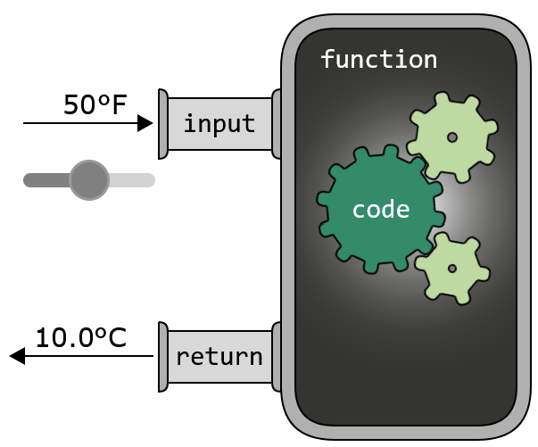
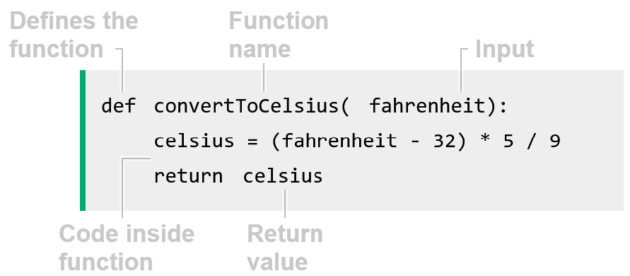

    Functions
        Functions are used to structure your code in a better way, so that your code becomes easier to read and to use.
        Functions makes it possible to re-use the same code many times, which is a huge benefit.

    What is a Function?
        A function holds a piece of code that does a specific task.
        A function takes some data as input, the code inside the function does something with the data,
        and then the result is returned.

        Below is how the Python code looks like for the convertToCelsius function:

        The function above takes a temperature in Fahrenheit as input, converts it into Celsius,
        and returns the Celsius value as output.
        Note: Functions can have different shapes and forms. Input and return are optional for example,
        but functions as explained here are how they usually appear, and how we normally think of them.

    When Should I Use a Function?
        If a part of your program does a specific task, you should create a function for it.
        It is especially useful to create a function if you need to run that code more than once,
        and from different parts of your program.

    Creating a Function
        Before using a function, you need to create it.
        Recipe for creating a function:
            Name the function.
            Define the input.
            Write the code inside the function, what you want the function to do.
            Define the return value.
        
        Creating our convertToCelsius function looks like this:
            Python:
                def convertToCelsius(fahrenheit):
                    celsius = (fahrenheit - 32) * 5 / 9
                    return celsius

            JavaScript:
                function convertToCelsius(fahrenheit) {
                    const celsius = (fahrenheit - 32) * 5 / 9;
                    return celsius;
                }

            Java:
                public static double convertToCelsius(double fahrenheit) {
                    double celsius = (fahrenheit - 32) * 5.0 / 9.0;
                    return celsius;
                }

            C++:
                double convertToCelsius(double fahrenheit) {
                    double celsius = (fahrenheit - 32) * 5.0 / 9.0;
                    return celsius;
                }
        
        Our function is named convertToCelsius. It takes fahrenheit as input, and returns celsius.
        But to make the function run, we need to call it.

    Calling a Function
        To call a function you write its name together with the input, and that makes the function run.
        After creating the convertToCelsius function, we can call it, converting 100°F into Celsius like this:
            Python:
                def convertToCelsius(fahrenheit):
                    celsius = (fahrenheit - 32) * 5 / 9
                    return celsius

                print(convertToCelsius(100))

            JavaScript:
                function convertToCelsius(fahrenheit) {
                    const celsius = (fahrenheit - 32) * 5 / 9;
                    return celsius;
                }

                console.log(convertToCelsius(100));

            Java:
                public class Main {
                    public static double convertToCelsius(double fahrenheit) {
                            double celsius = (fahrenheit - 32) * 5.0 / 9.0;
                            return celsius;
                    }

                    public static void main(String[] args) {
                            System.out.println(convertToCelsius(100));
                    }
                }

            C++:
                double convertToCelsius(double fahrenheit) {
                    double celsius = (fahrenheit - 32) * 5.0 / 9.0;
                    return celsius;
                }

                int main() {
                    cout << to_string(convertToCelsius(100)) + "\n";
                    return 0;
                }
        
        Running the example above, you can see we use print statements to see the result of the function call (the return value).
        Imagine we have many temperature measurements we need to convert from Fahrenheit to Celsius.
        Now that we have created the convertToCelsius function,
        we can just call that same function over and over again for each temperature in Fahrenheit we want to convert.

        functions can be called many times, and after making a function,
        we can use it knowing what it does, without having to understand how it does it.

    The Benefits of Using Functions
        The more programming you do, and the longer your programs get,
        the benefits from using functions become more and more obvious.

        The benefits we get from wrapping code that does a specific task into a function are many.
        Reusability:
            Write the code once, and reuse it as many times as you like,
            from different parts of your program. This saves time and effort, and you avoid repetition.
        
        Simpler programs:
            Functions make it easier to break down complex problems into smaller,
            more manageable pieces. This way of solving a problem is called divide and conquer.
        
        Readability:
            Creating functions for tasks, with names describing what the functions do,
            makes it easier to understand the code by reading it.
            It is easier to understand what this line of code does:
                convertToCelsius(60)
            than this:
                (60 - 32) * 5 / 9
        
        Fixing errors:
            If there is something wrong with the code inside the function, we only need to change the code in one place,
            so the code becomes easier to maintain. Alternatively, without using a function,
            the code with the error in it would perhaps be repeated many times in many places, making the error harder to fix.
        
        Collaboration:
            People can work together more easily when splitting the problem into functions that can be written separately.
            Functions create clear boundaries between parts of the program.
        
        Testing:
            Functions can be tested independently to ensure they work correctly.
        
        Scalability:
            Functions make it easier to expand and add new features to your programs.
        
        Abstraction:
            Allows you to hide complex details and focus on what the function does instead of how it works.

EOF
