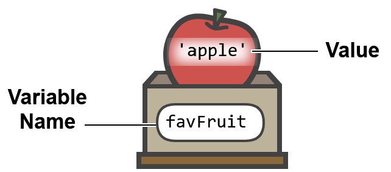
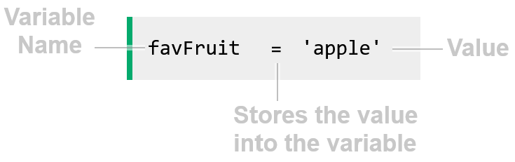

*Last Updated: 23.10.2025*

#### [< Previous][previous] / [Next >][next]

[previous]: https://github.com/rento-fox/Code-Guides/tree/main/Intro%20To%20Programming/ITP%20Tutorial/ITP%2001%20Programming 'ITP 01 Programming'
[next]: h 'I'

 

# Variables in Programming

Variables are one of the most basic and essential concepts in programming, used to store values.

## What is a Variable?
A variable has a name, and you can store something in it.

The image below shows how we can think of a variable named `favFruit`, with the value `'apple'` stored inside it.

Below is how we can create the `favFruit` variable, using Python code.

The code above creates a variable named `favFruit`, and the equal sign `=` is used to store the value `'apple'` inside the variable. 
The reason for giving a variable a name is to be able to use it later in the code, and also to know what value it holds.

## Creating a Variable
Below is the code for creating the `favAnimal` variable in different programming languages.

<table>
    <tr>
        <th>Python</th>
        <th>JavaScript</th>
    </tr>
    <tr>
        <td>
<pre><code>favAnimal = 'turtles'
</code></pre>
        </td>
        <td>
<pre><code>const favAnimal = 'turtles';
</code></pre>
        </td>
    </tr>
    <tr>
        <th>Java</th>
        <th>C++</th>
    </tr>
    <tr>
        <td>
<pre><code>String favAnimal = "turtles";
</code></pre>
        </td>
        <td>
<pre><code>string fav_animal = "turtles";
</code></pre>
        </td>
    </tr>
</table>

Variables can hold different types of data, like whole numbers, decimal numbers, or text.

> **Note:** When creating a variable in programming languages like C/C++ and Java, 
we must tell the computer what type of data the variable holds. 
To do that we need to write for example `int` in front of the variable name, 
if the variable holds a whole number (integer).

## Doing Things with Variables
Like we have just seen in the previous example, a value can be stored in a variable. 
And if you run the example code above, you see how a variable is printed. 
We can do other things with variables as well, like math operations, or put variables with text strings together.

## Add a Variable to a String
To use a variable in a string, you can add it to the string, like this:

<table>
    <tr>
        <th>Python</th>
        <th>JavaScript</th>
    </tr>
    <tr>
        <td>
<pre><code>a = 'Jane'
print('Hello, my name is ' + a)
</code></pre>
        </td>
        <td>
<pre><code>const a = 'Jane';
console.log('Hello, my name is ' + a);
</code></pre>
        </td>
    </tr>
    <tr>
        <th>Java</th>
        <th>C++</th>
    </tr>
    <tr>
        <td>
<pre><code>String a = "Jane";
System.out.println("Hello, my name is " + a);
</code></pre>
        </td>
        <td>
<pre><code>string a = "Jane";
cout << "Hello, my name is " + a;
</code></pre>
        </td>
    </tr>
</table>

## Add Two String Variables Together
You can add two string variables together to form a sentence, using the `+` operator, like this:

<table>
    <tr>
        <th>Python</th>
        <th>JavaScript</th>
    </tr>
    <tr>
        <td>
<pre><code>a = 'Jane'
b = 'My name is '
print(b + a)
</code></pre>
        </td>
        <td>
<pre><code>const a = 'Jane';
const b = 'My name is ';
console.log(b + a);
</code></pre>
        </td>
    </tr>
    <tr>
        <th>Java</th>
        <th>C++</th>
    </tr>
    <tr>
        <td>
<pre><code>String a = "Jane";
String b = "My name is ";
System.out.println(b + a);
</code></pre>
        </td>
        <td>
<pre><code>string a = "Jane";
string b = "My name is ";
cout << b + a;
</code></pre>
        </td>
    </tr>
</table>

## Add Two Number Variables
If the variables are numeric values, you can perform mathematic operations on them, like adding two numbers:

<table>
    <tr>
        <th>Python</th>
        <th>JavaScript</th>
    </tr>
    <tr>
        <td>
<pre><code>a = 2
b = 3
print(a + b)
</code></pre>
        </td>
        <td>
<pre><code>const a = 2;
const b = 3;
console.log(a + b);
</code></pre>
        </td>
    </tr>
    <tr>
        <th>Java</th>
        <th>C++</th>
    </tr>
    <tr>
        <td>
<pre><code>int a = 2;
int b = 3;
System.out.println(a + b);
</code></pre>
        </td>
        <td>
<pre><code>int a = 2;
int b = 3;
cout << a + b;
</code></pre>
        </td>
    </tr>
</table>

or other mathematical operations, like division:

<table>
    <tr>
        <th>Python</th>
        <th>JavaScript</th>
    </tr>
    <tr>
        <td>
<pre><code>a = 12
b = 3
print(a / b)
</code></pre>
        </td>
        <td>
<pre><code>const a = 12;
const b = 3;
console.log(a / b);
</code></pre>
        </td>
    </tr>
    <tr>
        <th>Java</th>
        <th>C++</th>
    </tr>
    <tr>
        <td>
<pre><code>int a = 12;
int b = 3;
System.out.println(a / b);
</code></pre>
        </td>
        <td>
<pre><code>int a = 12;
int b = 3;
cout << a / b;
</code></pre>
        </td>
    </tr>
</table>

Another way to add two variables, is to make an extra variable `c` to hold the sum, and present the answer with a text string:

<table>
    <tr>
        <th>Python</th>
        <th>JavaScript</th>
    </tr>
    <tr>
        <td>
<pre><code>a = 2
b = 3
c = a + b
print('The sum a + b is ' + str(c))
</code></pre>
        </td>
        <td>
<pre><code>const a = 2;
const b = 3;
const c = a + b;
console.log('The sum a + b is ' + c);
</code></pre>
        </td>
    </tr>
    <tr>
        <th>Java</th>
        <th>C++</th>
    </tr>
    <tr>
        <td>
<pre><code>int a = 2;
int b = 3;
int c = a + b;
System.out.println("The sum a + b is " + c);
</code></pre>
        </td>
        <td>
<pre><code>int a = 2;
int b = 3;
int c = a + b;
cout << "The sum a + b is " + to_string(c) + "\\n";
</code></pre>
        </td>
    </tr>
</table>

> **Note:** The `+` operator is used to both add numbers, and to put strings together. 
In Python and C++ we need to convert a number to a string before we can put it together with a string.

## Incrementing a Variable
We can create a variable, and update the value by adding 1 to it, like this:

<table>
    <tr>
        <th>Python</th>
        <th>JavaScript</th>
    </tr>
    <tr>
        <td>
<pre><code>a = 2
a = a + 1
print(a)
</code></pre>
        </td>
        <td>
<pre><code>let a = 2;
a = a + 1;
console.log(a);
</code></pre>
        </td>
    </tr>
    <tr>
        <th>Java</th>
        <th>C++</th>
    </tr>
    <tr>
        <td>
<pre><code>int a = 2;
a = a + 1;
System.out.println(a);
</code></pre>
        </td>
        <td>
<pre><code>int a = 2;
a = a + 1;
cout << a;
</code></pre>
        </td>
    </tr>
</table>

Incrementing a variable is a common operation in programming, and it's often used in loops. 
It is so common in fact, that many programming languages have a shorthand for it, like `++` in C/C++ and Java, or `+=` in Python.

The code below shows how to increment a variable in different programming languages, using shorthand.

<table>
    <tr>
        <th>Python</th>
        <th>JavaScript</th>
    </tr>
    <tr>
        <td>
<pre><code>a = 2
a += 1
print(a)
</code></pre>
        </td>
        <td>
<pre><code>let a = 2;
a ++ 1;
console.log(a);
</code></pre>
        </td>
    </tr>
    <tr>
        <th>Java</th>
        <th>C++</th>
    </tr>
    <tr>
        <td>
<pre><code>int a = 2;
a ++ 1;
System.out.println(a);
</code></pre>
        </td>
        <td>
<pre><code>int a = 2;
a ++ 1;
cout << a;
</code></pre>
        </td>
    </tr>
</table>

## Decrementing a Variable
If we want to decrement a variable, we can do that in a similar way as incrementing. 
And the number we want to decrement by can be any number, not just 1.

The code below shows how to decrement a variable by 3 in different programming languages, using shorthand.

<table>
    <tr>
        <th>Python</th>
        <th>JavaScript</th>
    </tr>
    <tr>
        <td>
<pre><code>a = 5
a -= 3
print(a)
</code></pre>
        </td>
        <td>
<pre><code>let a = 5;
a -= 3;
console.log(a);
</code></pre>
        </td>
    </tr>
    <tr>
        <th>Java</th>
        <th>C++</th>
    </tr>
    <tr>
        <td>
<pre><code>int a = 5;
a -= 3;
System.out.println(a);
</code></pre>
        </td>
        <td>
<pre><code>int a = 5;
a -= 3;
cout << a;
</code></pre>
        </td>
    </tr>
</table>

## Using a Variable in an if Statement
We can use a variable in an if statement, as part of the condition, like this:

<table>
    <tr>
        <th>Python</th>
        <th>JavaScript</th>
    </tr>
    <tr>
        <td>
<pre><code>temperature = 25
print('Temperature: ' + str(temperature) + '°C')
 
if temperature > 20:
    print('It is warm')
else:
    print('It is not warm')
</code></pre>
        </td>
        <td>
<pre><code>const temperature = 25;
console.log('Temperature: ' + temperature + '°C');
 
if (temperature > 20) {
    console.log('It is warm');
} else {
    console.log('It is not warm');
}
</code></pre>
        </td>
    </tr>
    <tr>
        <th>Java</th>
        <th>C++</th>
    </tr>
    <tr>
        <td>
<pre><code>int temperature = 25;
System.out.println("Temperature: " + temperature + "°C");
 
if (temperature > 20) {
    System.out.println("It is warm");
} else {
    System.out.println("It is not warm");
}
</code></pre>
        </td>
        <td>
<pre><code>int temperature = 25;
cout << "Temperature: " + to_string(temperature) + "°C\\n";
 
if (temperature > 20) {
    cout << "It is warm\\n";
} else {
    cout << "It is not warm\\n";
}
</code></pre>
        </td>
    </tr>
</table>

## The Variable Name
There are certain rules that apply when naming a variable. 
Some rules are programming-language specific, others apply to all programming languages:

- A variable name cannot contain spaces.
- A variable name cannot start with a number.
- A variable name cannot be a reserved word like if, else, for, function etc.

For readability, it is common to use **camelCase** or **snake_case** when naming variables, 
so instead of `myfavanimal`, we can use `myFavAnimal` or `my_fav_animal`.

 

#### [< Previous][previous] / [Next >][next]

[previous]: https://github.com/rento-fox/Code-Guides/tree/main/Intro%20To%20Programming/ITP%20Tutorial/ITP%2001%20Programming 'ITP 01 Programming'
[next]: h 'I'

 

*EOF*
